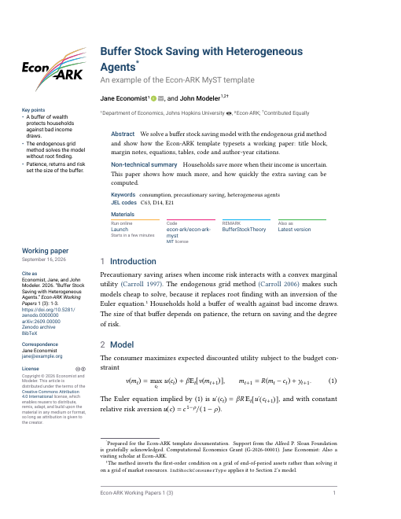

# Econ-ARK MyST Template

A Typst PDF template for Econ-ARK working papers, REMARKs and technical reports, for use with [MyST](https://mystmd.org).

In your `myst.yml` or article frontmatter add:

```yaml
exports:
  - id: pdf
    format: typst
    template: https://github.com/econ-ark/econ-ark-myst.git
    article: paper.md
    output: exports/paper.pdf
    kind: Working paper
```

Then run `myst build --typst`.

While the repository is private, MyST cannot download it and the URL above fails with a 404. Clone the repository and give `template:` the path to the clone instead.

## Requirements

- Typst 0.13 or newer (tested with 0.13.1 and 0.15.1). Typst 0.12 fails inside the `pubmatter` package.
- Install [Roboto](https://github.com/googlefonts/roboto-3-classic) for headings and [Libertinus Math](https://github.com/alerque/libertinus) for equations. Without them the template still compiles with fonts bundled in the Typst binary. Headings fall back to Libertinus Serif and equations to New Computer Modern Math.

## Frontmatter

| Field | Where it appears | When unset |
|-------|------------------|------------|
| `title` | Title block, plus the running header when `short_title` is unset | Required |
| `subtitle` | Grey line under the title | Omitted |
| `authors` | Title block and "Cite as" entry | Required; MyST reports an error but still builds |
| author `orcid`, `email` | Linked icons after the name | Omitted |
| author `corresponding`, `email` | "Correspondence" in the margin, naming the first author with `corresponding: true`, or else the first with an email | Omitted when no author has an email |
| author `equal_contributor` | Dagger after the name, explained under the affiliations | Omitted |
| author `note` | Starred footnote on the title, for thanks and funding | Omitted |
| `affiliations`, affiliation `ror` | Numbered list under the authors, with a linked ROR icon | Omitted |
| `short_title` | Running header from page two | The title |
| `venue.title` | Footer and "Cite as" entry | Page number only |
| `open_access` | "Open Access" badge at the top of page one when `true` | Omitted |
| `subject` | Margin, as the kind of paper, for example `Working paper` or `REMARK` | Omitted |
| `date` | Margin, plus the year in the "Cite as" entry | The build date, so set it for a PDF that rebuilds identically |
| `keywords` | Under the abstract | Omitted |
| `tags` | JEL codes under the keywords. The [Econometric Society template](https://github.com/alanlujan91/econsoc_template) reads the same field, so one manuscript builds with both | Omitted |
| `doi`, `arxiv`, `zenodo` | "Cite as" block in the margin, described below | No "Cite as" block |
| `volume`, `issue`, `last_page` | Added to the "Cite as" entry | Left out of the entry |
| `license` | Margin, with a Creative Commons badge and a copyright line | Omitted |
| `github`, `binder` | "Reproduce this paper" strip under the abstract | The strip shows whichever is set, and disappears when neither is |
| `first_page` | Starting page number, also the first page in the "Cite as" entry | Pages start at 1 |
| `bibliography` | References, in Chicago author-date style, after the declarations | No references section |

These are all the fields the template reads. It ignores `funding`, author `url` and every affiliation detail beyond the name and ROR, so put a funding statement in an author `note` or the `title_note` part.

The "Cite as" block appears once the paper has a `doi`, `arxiv` or `zenodo` link, since a draft without a persistent identifier changes under its readers. It gives a Chicago author-date entry, the style of the reference list, followed by the DOI as a URL, the arXiv identifier and a link to the Zenodo archive. The entry lists up to three authors and shortens more to the first author and "et al." MyST reads a suffix such as "Jr." as part of the family name. To cite such a name correctly, give the author's `name` as an object with `given`, `family` and `suffix`.

## Options

| Option | Description |
|--------|-------------|
| `kind` | Label in the margin, overriding `subject` for this export |
| `linenumbers` | Number the lines of the main text, for review drafts |

## Parts

| Part | In the PDF | On a MyST site with article-theme |
|------|------------|-----------------------------------|
| `abstract` | Run-in abstract under the title | Above the page |
| `keypoints` | Three or four short bullet points, at most 80 words, in the margin under the logo. When the margin cannot hold them above its lower notes, they move under the abstract | Above the page, as "Key Points" |
| `acknowledgments` | First unnumbered section of the back matter (`acknowledgements` and `acknowledgement` also work) | Below the page |
| `data_availability` | Unnumbered section after the acknowledgments | Below the page |
| `declaration` | Unnumbered "Declaration of competing interest" after the data availability statement | In the text, where the block is written |
| `ai_declaration` | Unnumbered "Declaration of generative AI use", immediately before the references. Same part name as [elsarticle-myst](https://github.com/alanlujan91/elsarticle-myst) | In the text, where the block is written |
| `title_note` | Starred footnote on the title, placed before any author notes | In the text, where the block is written |

The back matter, these four sections and then the references, goes before the `<appendix>` marker, or at the end of the paper when there is no marker. MyST removes a part from the text of a PDF wherever it is written. The `parts:` key of the project frontmatter does not reach a PDF export.

## Where the values come from

When you export one page, its frontmatter replaces the project's field by field, and any field the page leaves out comes from the project. An export with `articles:` works differently. MyST ignores the frontmatter of every page, including the page that holds the export block, and takes each field from the project. A field written in the export block replaces the project's value for that export only. This holds for every field in the table above, `keywords`, `date`, `github` and `subject` included. Options such as `kind` go only in the export block.

Parts behave differently. In an `articles:` export MyST collects each part from every article, so the acknowledgments can live in the supplement and the declaration in the paper. When two articles give the same part, the first article's wins and MyST reports an error naming the one it ignored.

## Theorems and proofs

MyST `prf:` directives (`prf:theorem`, `prf:proposition`, `prf:lemma`, `prf:definition`, `prf:assumption`, `prf:proof` and the rest) are set in the flow of the text: a bold label and number, the optional title in parentheses, then the statement. Theorems, propositions, lemmas, corollaries, conjectures and claims are italic. Definitions, assumptions and remarks are upright. A proof ends with a square. Each kind is numbered separately, and `@label` gives "Proposition 1".

## Tables

Tables take captions above them and set their cells unjustified, unhyphenated and at 9pt. A table MyST parses from markdown or from a raw LaTeX `tabular` gets one automatic width per column, which crowds a table with many columns into the text column. For such a table, write a native Typst table in a `:::{raw:typst}` block, where you can set column widths, and pass the figure to `fullwidth`:

```text
:::{raw:typst}
#fullwidth[#figure(
  table(
    columns: (8em, ..range(10).map(_ => 1fr)),
    stroke: none,
    [Case], ..range(10).map(i => [#i]),
  ),
  caption: [Results for all ten cases.],
) <tbl-wide>]
:::
```

MyST does not know labels defined inside raw Typst, and `@tbl-wide` in the text fails the build with "the document does not contain a bibliography". Refer to the table with the inline role {raw:typst}`@tbl-wide` instead.

`fullwidth` spans the margin rail and the text column and floats the figure to the top or bottom of the page. On page one the margin holds the logo and notes, so a figure anchored there floats to the bottom of the page at column width. A float can land above an in-flow table that the text introduces earlier.

`fullwidth(float: false, ...)` keeps the figure in the text flow, directly after the sentence that introduces it, as LaTeX `[h]` does. A figure that does not fit the rest of the page moves whole to the next page and leaves white space. Use it from page two on, because on page one the wide figure would run over the margin notes.

## Appendices

Open the appendices in the body with a marker, then write them as ordinary `#` sections:

```text
:::{raw:typst}
#metadata("appendix") <appendix>
:::

(app-proofs)=
# Proofs
```

After the marker, top-level sections read "Appendix A", "Appendix B" and their subsections "A.1", "A.2". Each top-level section is its own lettered appendix, so for a single appendix with numbered parts, write the parts as subsections of one top-level section. An unnumbered heading, such as a supplement title, leaves the lettering unchanged. The acknowledgments, declarations and references move to just before the marker, the usual order in economics papers. Add `#pagebreak()` inside the marker block to start the appendices on a new page. The marker also works inside an article of a multi-article export. There MyST turns each article's title into a top-level heading and moves its sections down a level, so the marker letters the next article's title rather than the sections that follow it. List each article with `level: 0` and `title: null` to keep its sections at their own level, so that "Appendix A" goes to the first `#` section after the marker.

To keep an appendix in its own file, pull it in after the marker with the `include` directive and list the pages in the project `toc`. Without a `toc` the included file is also a page of its own, and MyST warns about duplicate identifiers.

`@app-proofs` prints the section title. To print "Appendix A", use {raw:typst}`@app-proofs`, which appears in the PDF only. Equations, figures and tables keep one numbering sequence through the appendices, because MyST writes their reference numbers into the text before Typst lays out the page.

The template defines no `appendix` part, so write appendices in the body.

## Several articles in one PDF

An export with `articles:` renders each article as a separate Typst file, which cannot see the names the template defines. In every article of such an export, MyST tables fall back to its default style (the template still removes their vertical rules and sets their size), `prf:` blocks float to the top of the page in tinted boxes, and `fullwidth` is undefined. To keep the template's styling, write one article that pulls the others in with the `include` directive:

````text
```{include} supplement.md
```
````

If you keep `articles:`, MyST restarts figure and table numbers in each article while the PDF numbers them continuously, so references and captions disagree. Set `numbering: {figure: {continue: true}, table: {continue: true}}` in the frontmatter of every article after the first.

A table without a caption, such as the output of a code cell, is drawn with every grid line in an article after the first. To give it the template's rules, start that article with a block that rebinds the style for the rest of the file:

```text
:::{raw:typst}
#import "econark.typ": arkTableStyle
#let tableStyle = arkTableStyle
:::
```

Import `smallTableStyle` instead for 7pt tables.

The running header of an `articles:` export takes the `short_title` of the project. To use a different one, set `short_title` in the export block.

## Known limitations

| Symptom | Cause | Workaround |
|---------|-------|------------|
| `[Section %s](#label)` prints "Section ??" | MyST resolves `%s` to nothing for headings in a single-article export, even with `numbering: headings: true` ([mystmd#3035](https://github.com/jupyter-book/mystmd/pull/3035)) | Refer to sections by name with `@label` or `[](#label)`, which print the section title |
| A long table without a caption prints `state("tablex_tablex_header_pages__...") did not converge` | The table package MyST uses repeats the header on each page and needs more layout passes than Typst allows | Ignore the warning, because the table still breaks across pages with its header repeated |
| A table or figure taller than the page runs off the bottom | Figures and tables never break across pages, which stops a short table from splitting | Split a long table into two |

## Example

`examples/paper.md` exercises every field above, and `examples/minimal.md` uses as few as possible. The rendered `examples/exports/paper.pdf` is tracked. The PDF carries no creation timestamp, so rebuilding an unchanged example leaves it byte-identical.

```bash
cd examples
myst build --typst
```



## Checks

`scripts/check-examples.sh` rebuilds both examples and reads the text of the exported PDFs. It fails when a PDF was not written, when a literal `??` marks an unresolved reference, when text from a template feature is missing, or when the PDF carries a creation timestamp. `myst build` exits 0 in all of these cases. `--self-test` seeds each defect and confirms the check catches it. CI runs both on every push with the same Typst, mystmd and fonts used for the tracked PDF.

## License

MIT; adapted from [curvenote-templates/openrxivlabs](https://github.com/curvenote-templates/openrxivlabs). See [LICENSE](LICENSE).
